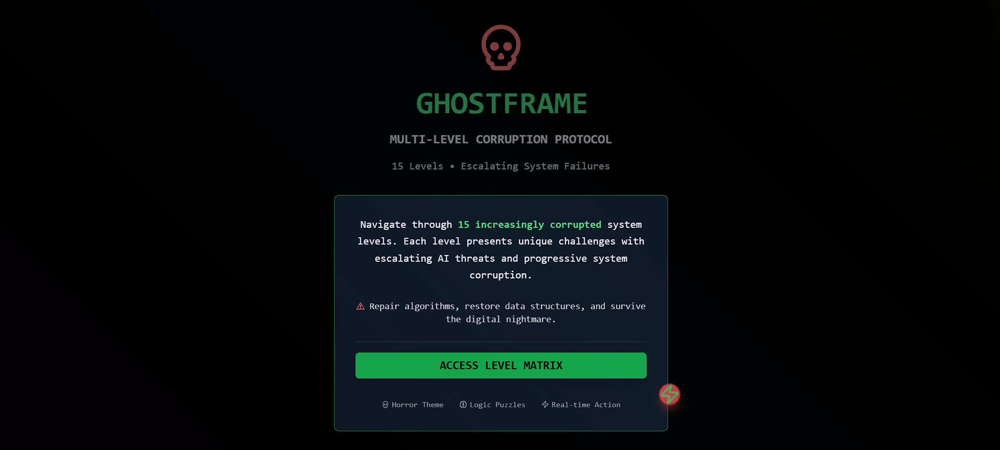

# 👻 GhostFrame

**A Glitch Horror Web Game** — Trapped in a corrupted simulation. Can you escape?

🎮 [Play Now on Vercel](https://ghostframe-seven.vercel.app/)

---

## 🕹️ About the Game

**GhostFrame** is a single-player glitch horror web game that plunges you into a haunted, corrupted digital world. Built using **Next.js** and **Tailwind CSS**, the game challenges you to solve eerie puzzles, interpret distorted visuals, and break the very code that confines you.

> “Was trying to practice frontend dev… ended up summoning a ghost in my browser.” 💀

---

## 🌐 Live Demo

🔗 [https://ghostframe-seven.vercel.app](https://ghostframe-seven.vercel.app)

---

## 🧩 Features

- 🕳️ Glitch Horror Vibes with CSS + Canvas Effects  
- 🧠 Visual Puzzles & Code-Based Riddles  
- 💻 Simulation Breakdown & Hidden Clues  
- 📟 Minimal UI + Creepy Sound Design  
- 🧠 No jumpscares – just psychological weirdness

---

## ⚙️ Tech Stack

- **Framework**: [Next.js](https://nextjs.org/)
- **Styling**: [Tailwind CSS](https://tailwindcss.com/)
- **Effects**: CSS keyframes, glitch filters, and Canvas for corruption visuals
- **Deployment**: [Vercel](https://vercel.com/)

---

## 🚀 Getting Started Locally

1. **Clone the Repository**
   ```bash
   git clone https://github.com/Chaitanyahoon/ghostframe.git
   cd ghostframe
   ```

2. **Install Dependencies**
   ```bash
   bash 
   npm install
   ```
3. **Run the Development Server**
   ```bash
   npm run dev
   ```
4. **Open http://localhost:3000 in your browser to play locally.**

## 📸 Screenshot


## 📣 Share Your Score!
 *Post it on LinkedIn and tag me!
 Add something like:*

“Couldn’t find a job, so I made a haunted game: 
http://ghostframe-seven.vercel.app 👻💻 What’s your score?”

## 🧠 Fun Fact

   *In GhostFrame, sometimes the “error” is your only way forward.*\

---

### 🧾 `LICENSE` (MIT License)

```text
MIT License

Copyright (c) 2025 Chaitanya Patil

Permission is hereby granted, free of charge, to any person obtaining a copy
of this software and associated documentation files (the "Software"), to deal
in the Software without restriction, including without limitation the rights  
to use, copy, modify, merge, publish, distribute, sublicense, and/or sell  
copies of the Software, and to permit persons to whom the Software is  
furnished to do so, subject to the following conditions:

The above copyright notice and this permission notice shall be included in all  
copies or substantial portions of the Software.
```


